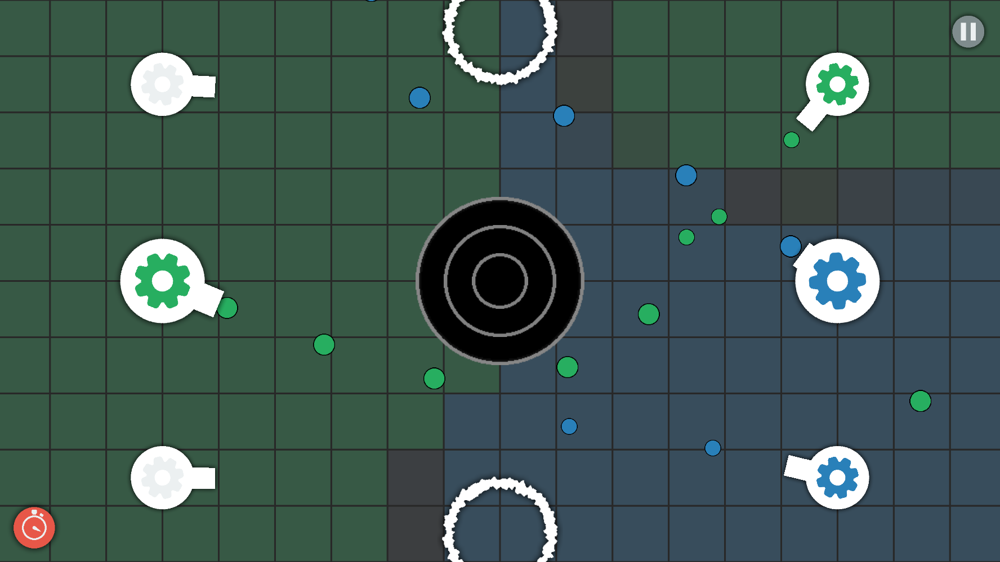

Cannon Conquest      
===============

Source code of an android/UWP/iOS game I made

Features
 - Farseer Physics Simulation
 - Over 100 levels
 - Online Highscore
 - Online Account Synchronization
 - My own game engine based around MonoGame (special thanks to the guys at [MonoGame.Extended](https://github.com/craftworkgames/MonoGame.Extended))
 - Cross-platform via Xamarin
 - Online (UDP/IP) Multiplayer
 - Local Bluetooth Multiplayer
 - 6 different turret types
 - many different environment objects
 - levels with different geometrical properties
 - A (really) challenging AI
 - Background music and sound effects
 - Self made graphics (not sure if this is a good thing...)

